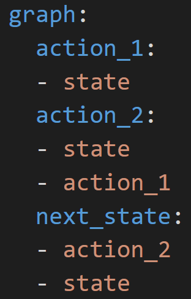

# AI Decision•Reinforcement Learning Development Challenge——Learn to make fair promotion policy

## Baseline Scheme and Code

The technical methods used in the challenge are not limited. This article introduces the baseline scheme [Polixir](http://polixir.ai/) provides for the challenge. The baseline scheme is based on the `Polixir Revive SDK` ( Download link： https://revive.cn ). For detailed code examples, please refer to the `sample_submission` folder in `starting_kit.zip`.
In this scheme, we will use the `Revive SDK` to learn the environment model from historical data. The environment model contains the simulation of each user, and then we train the promotion policy in the environment model. In this process, we will complete the following steps：

1. Define user state (user portrait)

2. Learn virtual environment

3. Learn promotion policy

The following content describes each step separately。

##### Define Individual User State

In order to learn the user model, firstly, we need to define the user state (user portrait). As a baseline, we take the simplest (not the best) way to define the state of each user.

The competition data provides a 60-day history of promotion actions and user actions. The promotion actions received by each user are different within a single day. We only take the data of the first 30 days of the 60-days data to define the initial state of the user, and the data of the next 30 days will be used to learn the user model.

We define the three-dimensional features shown in Table 1 below to represent the initial state of each user. It is worth noting that the user state defined in Table 1 is the simplest way. In order to obtain better results, contestants need to customize more complex user states.


| Feature      | Description  |
| ----------- | ------------------------------------------- |
| total_num   | The total number of orders in the user's history                            |
| average_num | The average number of per-day orders in the user's history |
| average_fee | The average fee of per-day orders in the user's history |

<center> Table 1. Individual user state definition </center>

Based on the definition of the user state in Table 1, if we use `state` to represent the user state of the current day, the user's action on that day is `act`. Since `act[0]` represents the number of users’ orders on the day, and`act[1]` represents the average price of users’ orders on the day, so in order to get the user state `next_state` of the next day, we can use `act` to directly calculate each dimension of `next_state`. The transition rules are as follows:

```python
import numpy as np

next_state = np.empty(state.shape)
size = (state[0] / state[1]) if state[1] > 0 else 0
next_state[0] = state[0] + act[0]
next_state[1] = state[1] + 1 / (size + 1) * (act[0] - state[1])
next_state[2] = state[2] + 1 / (size + 1) * (act[1] - state[2])
```

We take the initial state of the user obtained through the historical data of the previous 30 days as the user state on the 31st day.

For the sake of simplicity, based on the above transition rules, we have user actions from the 31st to the 60th day in the competition data, and we can transfer to get the user states from the 32nd to the 61st day (It is worth noting that this assumption is not in line with the actual situation, because the state of users will be affected by different promotion behaviors).

##### Virtual Environment Learning Based on Revive SDK

For each user, their user state、promotion action and user action data from the 31st to the 60th day conform to the decision flow chart shown in Figure 1: The promotion policy determines the promotion action, which inputs the user state of the day and outputs the promotion action of the day. The user policy determines the user action. It inputs the user state and the promotion action of the day, and outputs the user action of the day. With user action (For simplicity, in the baseline without considering the impact of promotion action), we can generate the user state for the next day. So if we learn the user policy, we are equivalent to learning the virtual environment.

<center>

Figure 1. Decision flow chart
</center>

We use the `Revive SDK` tool to learn user policy. `Revive SDK` supports writing a yaml file to describe the decision-making process in Figure 1. Part of the content of the file is shown in the figure 2 below:


<center>

Figure 2. A diagram of the yaml file corresponding to the decision process
</center>


The part beginning with `graph` is responsible for describing the decision-making process. Among them, `state`、`action_1`、`action_2`and `next_state` are custom variable names,  which represent `user state of the day`、`promotion action`、`user action` and ` user state of the next day` respectively. From the yaml file, we can see that the value of `action_1` is affected by `state`, and the corresponding decision diagram is that `user state of the day` points to `promotion action`, which can also be understood as `action_1` is the output, and `state` is the corresponding input. In the same way, the value of `action_2` is affected by `state` and `action_1`, and the value of `next_state` is affected by `state` and `action_2`. After the yaml file is defined, the relevant training data and training parameters can be configured,  and then we can call the algorithm package to start training. After the training is completed, we can get the user policy model `venv_model` . The use of the `venv_model` model is as follows:

```python
import numpy as np

def venv_model_use_demo(states, coupon_actions):
    """Call user policy model
    Args:
    	states(np.array): user states
    	coupon_actions(np.array): promotion actions
    Return:
    	user_actions(np.array): user actions
    """
    out = venv_model.infer_one_step({'state':states, 'action_1':coupon_actions})
	return out['action_2']
```

##### Learn Fair Promotion Policy Based on Virtual Environment

For the unfair promotion policy, it inputs the state of a single user and outputs the promotion action issued to a single user, so each person's promotion action can be different. To learn a fair promotion policy, it inputs the states of all users, and outputs a promotion action that is issued to all users. If the states of all users are directly spliced into a one-dimensional array, it is a very high-dimensional input. Therefore, dimension reduction processing is required. Here we use the simplest way to calculate the statistics of each dimension of the states of all users on the single day, and additionally introduce the two-dimensional real-time statistics. The implementation code is as follows:

```python
import numpy as np

def _states_to_obs(states: np.ndarray, day_total_order_num: int=0, day_roi: float=0.0):
    """Reduce the dimension of the two-dimensional array of all user states to a one-dimensional
       user group state
        Args:
            states(np.ndarray): A two-dimensional array containing the state of each user
            day_total_order_num(int): The total number of orders of all users in the previous day. If it is             	                      the first day, the default is 0
            day_roi(float): The ROI of all users in the previous day. If it is the first day, the default is 				             0.0
        Return:
            user group state(np.array)
        """
    assert len(states.shape) == 2
    mean_obs = np.mean(states, axis=0)
    std_obs = np.std(states, axis=0)
    max_obs = np.max(states, axis=0)
    min_obs = np.min(states, axis=0)
    day_total_order_num, day_roi = np.array([day_total_order_num]), np.array([day_roi])
    return np.concatenate([mean_obs, std_obs, max_obs, min_obs, day_total_order_num, day_roi], 0)
```

The state of the user group obtained after dimension reduction is the real input of the fair promotion policy, and the promotion action space of the policy is consistent with the competition data. We use reinforcement learning algorithm in the virtual user environment learned from `Revive SDK` to learn the fair promotion policy. The initial state set of the virtual user environment uses the states of all users on each day from the 31st to the 60th day. The transition function is based on the user policy and transition rules. It inputs the states of all users on the day and the same promotion action, the user policy outputs all the user actions on the day, and the transition rules use all user actions to update the state of all users. In addition, the reward function of the problem is defined as follows:

```python
from gym import Env

class VirtualMarketEnv(Env):
	MAX_ENV_STEP = 14 # Evaluation days, as the step length of the environment
	ROI_THRESHOLD = 7.5 # Considering the virtual environment error, the ROI threshold is 7.5, which is 1.0                           higher than the actual online 6.5
	ZERO_GMV = 81840.0763705537 # In the online evaluation environment, the total GMV returned by not                                         issuing any coupons during the evaluation days
    # self.total_gmv: Total GMV during the evaluation period
    # self.total_cost: Total cost during the evaluation period
    def step(self, action):
        ...
        # Sparse reward, the final total reward is returned on the last day of evaluation, and the rewards             on the previous days are all 0
        if (self.current_env_step+1) < VirtualMarketEnv.MAX_ENV_STEP:
            reward = 0
        else:
            total_roi = self.total_gmv / self.total_cost
            if total_roi >= VirtualMarketEnv.ROI_THRESHOLD:
                # Exceeding the ROI threshold, (total GMV/baseline total GMV) as reward
            	reward = self.total_gmv / VirtualMarketEnv.ZERO_GMV
            else: # Otherwise, (total ROI - ROI threshold) as reward
            	reward = total_roi - VirtualMarketEnv.ROI_THRESHOLD
```

After determining the MDP of the entire problem, any feasible reinforcement learning algorithm can be used. The `Proximal Policy Optimization (PPO)` is directly used in the Baseline to train the final fair promotion policy. It should be noted that PPO trains a random policy. If the random policy is directly submitted, it may cause random disturbances in the results of each evaluation.

##### Policy Submission

After training the fair promotion policy, you need to upload the policy for online evaluation. The uploaded policy is a packaged zip file with `policy_validation.py` as the entry point, and the environment required for online evaluation is specified through the `metadata` file (we support: `pytorch-1.8`, `pytorch-1.9 `, `pytorch-1.10`).

In `policy_validation.py`, there is a `PolicyValidation` interface class, and a `get_pv_instance()` function that returns an instance of `PolicyValidation`. After submitting the policy, the online environment will call `get_pv_instance()`, and evaluate policy of the contestants according to the interface specification defined by `PolicyValidation`. Contestants need to inherit the `PolicyValidation` interface class, implement the required abstract methods and members, and return their inherited subclass instances in the implementation of `get_pv_instance()`.

Specifically, the `PolicyValidation` class requires:

* Initialize the initial state of all users of the `PolicyValidation` class with the user state data on the 61st day (corresponding to the user state on the first day of evaluation).
* According to the states of all users、promotion action and user actions on the day, return the states of all users on the next day.
* According to the states of all users on that day, return the promotion action for that day.

For detailed code examples, please refer to the `sample_submission` folder in `starting_kit.zip`.
