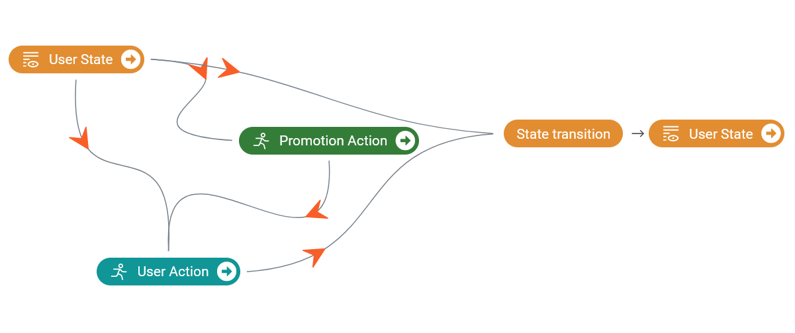

# Starting Kit 使用指引

该Starting Kit包含了基于Polixir Revive工具包实现离线强化学习决策的实例。其中包含两个文件夹:

1. `baseline`: 包含了数据预处理、构建虚拟环境、训练策略的代码。

2. `sample_submission`: 一个用于在比赛网站上提交的文件包实例。得到新的策略模型后，可以替换文件包中的相应部分，并在网站上提交。

在bash（或兼容）环境中运行脚本文件`run_baseline.sh`，将运行训练策略模型的全过程，并生成用于提交的压缩包。

你可以使用该基线模型与样例提交作为你自己的模型实现的入口点。基线模型由`Revive SDK`与`stablebaselines3`库提供，但选手自己的模型该如何实现则没有任何限制。

## 开发环境的准备工作

1. `Linux x86_64`。使用Windows的开发者可以使用WSL2，并配合 VSCode + WSL 插件进行无缝开发（WSL2的GPU在Windows 11或新版本的Windows中同样受到支持）。Revive SDK也提供了一个[VSCode插件](https://marketplace.visualstudio.com/items?itemName=Polixir.polixir-revive)，以协助修改决策流图与超参配置。
3. `Python 3.6, Python 3.7 or Python 3.8` + `Pytorch`. Revive SDK 暂未支持 Python 3.9，所以你可以为基线模型专门准备一份Python 3.8的环境。**注意，该notebook需要运行在与baseline模型相同的环境**。
4. 文件路径使用ASCII字符，中文字符可能导致 `UnicodeEncodeError`。

## 数组组织格式

所有关于基线模型的数据文件都保存与组织在`baseline/data`文件夹中，包括：

1. 公共数据集

  * `offline_592_1000.csv`: 初赛提供的公共离线数据集，包含1000位用户在60天内的数据。

2. 数据预处理

  * `offline_592_3_dim_state.csv`: 处理后的离线数据集，新插入了3维的用户状态 (`total_num`,`average_num`,`average_fee`).
  * `user_states_by_day.npy`: 所有用户在`60-x`天的状态，而前`x`天的状态都被压缩为了初始状态。在基线模型中，`x`设为30天。
  * `evaluation_start_states.npy`: 离线数据集中最后一天结束时的用户状态，将作为线上评估时的初始状态。

3. 训练虚拟环境

  * `license.lic`: Revive SDK所需的许可文件。本Starting Kit携带一份直到比赛结束前有效的公共许可，或可以在Revive官网申请私人许可。
  * `venv.yaml`: 定义决策流图的元数据文件，预包含在Starting Kit中。
  * `venv.npz`: 存放离线数据的文件，与`venv.yaml`中定义的数据格式一致。在数据预处理阶段中生成。
  * `venv.py`: 用于向决策图中引入专家函数，以提供先验或约束神经网络输出。
  * `venv.pkl`: 训练好的虚拟环境文件。

4. 训练策略模型

  * `model_checkpoints/rl_model_*_steps.zip`: 训练策略模型途中保存的模型。
  * `rl_model.zip`: 最终选择出来用于提交的模型。

**NOTE**: `evaluation_start_states.npy`与`rl_model.zip`将会被复制到  `sample_submission/data`文件夹中，用于线上验证时的模型参数； `user_states.py`将会被复制到`sample_submission`文件夹中，用于向模型提供状态定义。

先从检查Python环境开始：
```
!which python3
!python3 --version
```

如果你在使用Conda环境，需要确认`which python3`输出的路径是来自于你为基线模型准备的环境。此外，需要确认Python版本是符合上述要求的（3.6~3.8）。

然后，我们定义标志基线模型根目录的环境变量：
```python
import os

baseline_root = f"{os.getcwd()}/baseline"

%env BASELINE_ROOT=$baseline_root
```

**重要提醒**：
1. **这个代码块需要在每次重新打开Notebook的时候运行，以保证Python环境的`$baseline_root`变量与Shell环境的`$BASELINE_ROOT`变量被正确设置。**
2. **确认Notebook环境是在`starting_kit`目录下运行的，否则`$baseline_root`变量不会被正确设置。**

# 第一步：从离线数据中获取用户状态

首先，切换到数据目录并从developmental phase下载公共数据：

```python
%pushd $baseline_root/data
!wget -q https://codalab.lisn.upsaclay.fr/my/datasets/download/eea9f5b7-3933-47cf-ba6f-394218eeb913 -O public_data_dev.zip
!unzip -o public_data_dev.zip
%popd # Leave data directory
```

公共离线数据集仅包含公司促销操作、用户响应操作和索引、步骤、日期等元数据。我们需要从这个离线数据集中导出用户的状态（用户的描述），并用它来构建我们的虚拟环境模型。

作为基线，我们在这里将用户状态定义为一个简单的 3 维特征：

|   Feature   |                         Description                          |
| :---------: | :----------------------------------------------------------: |
|  total_num  |  用户历史订单总数      |
| average_num | 用户历史平均日订单数 |
| average_fee | 用户历史单日订单平均费用 |

请注意，**定义正确的用户状态是有效虚拟环境的关键**。上表中定义的状态简单明了，但参与者有必要定义更健壮和合理的用户状态。

为方便起见，与用户状态定义相关的代码在 `user_states.py` 中定义，其中：
* 一个 `get_state_names` 函数定义为给每个状态的维度一个名称。
* 一个 `get_next_state` 函数定义为根据当前状态和用户动作（`day_order_num` 和 `day_average_order_fee`）计算下一个状态。

因此，当你想改变用户状态定义时，只需要修改`user_states.py`中的代码，修改将适用于所有与用户状态相关的逻辑。

看一下baseline中状态的代码定义：

```python
import inspect
import user_states

print(inspect.getsource(user_states.get_state_names))
print(inspect.getsource(user_states.get_next_state))
```

基线状态实现的一些说明：
1. `get_next_state` 以通用方式定义，因为该函数将同时使用 numpy 数组和 pytorch 张量调用。所以在修改状态的定义时要小心，比如避免使用只存在于一个库中的 API。
2. 如果您发现无法在 `get_next_state` 中维护通用实现，可以将此定义复制到引用它的 `get_next_state_torch` 中，这样`numpy`和`torch`就会各自使用不同的实现了。
3. 处理 pytorch 张量时，请注意其设备，因为来自 `cpu` 和 `cuda` 设备的张量都将被传递给 Revive SDK 中的 `get_next_state` 函数。您可以使用 `states.new_<zeros/ones/empty>` API 从 `states` 的同一设备创建新张量。
4. `next_state` 作为参数传递给 `get_next_state` 函数，这意味着您必须在调用 `get_next_state` 函数之前为 `next_state` 预先分配数组/张量。这是为了维护它的通用实现，因为 numpy 使用 `np.empty`，而 torch 使用 `Tensor.new_empty`。

基线状态定义设计的一些细节：

1. 这是一个循环状态定义，意思是用户在某一天的状态是该用户历史中所有天的累加结果。因此，第 31 天的用户状态是所有前 30 天的缩减状态。
2. Baseline 通过 `total_num / average_num` 计算当前天数，其结果在仅考虑非零订单计算天数时正确。要正确计算所有天数的平均值，您需要将此信息融合到新定义的用户状态中，或使用诸如折扣因子的策略。
3. 在计算用户状态之前可以对数据进行一些约束。例如，如果您的 venv 模型以连续方式输出`day_order_num`，则可以使用 `round()` 方法将其转换为整数。此外，零订单的天数也应该产生零费用，因此当一个值为0时，它们可以相互强制限制为0。

为了保持基线简单，我们使用第 31 天的状态作为初始状态，表示前 30 天收集的用户数据。然后我们可以继续学习基于从第 31 天到第 60 天的过渡的虚拟环境（需要注意的是，这个假设不符合用户状态受不同促销行为影响的事实）。

这种想法在 `data_preprocess.py` 中实现，我们可以运行它来将公共数据 `offline_592_1000.csv` 转换为处理过的数据 `offline_592_3_dim_state.csv`、`user_states_by_day.npy`、`evaluation_start_states.npy` 和 `venv.npz` ：


```python
%pushd $baseline_root/data
import numpy as np
import importlib
import data_preprocess
import sys

importlib.reload(data_preprocess)

offline_data_with_states, user_states_by_day, evaluation_start_states, offline_data_with_states_npz = data_preprocess.data_preprocess("offline_592_1000.csv")
print(offline_data_with_states.shape)
print(user_states_by_day.shape)
print(evaluation_start_states.shape)
offline_data_with_states.to_csv('offline_592_3_dim_state.csv', index=False)
np.save('user_states_by_day.npy', user_states_by_day)
np.save('evaluation_start_states.npy', evaluation_start_states)
np.savez('venv.npz', **offline_data_with_states_npz)
%popd
```

# 第二步：学习虚拟环境

下面显示了我们离线 RL 问题的决策流程图：



在这里，`User State` 由我们定义，而`Promotion Action` 将在我们的提交策略中实现，因此为了使整个流程正常工作，我们需要将`User Action` 模拟为虚拟环境。这相当于从离线数据集中学习用户策略模型，该模型可以从用户状态和促销动作输出用户动作。


在基线中，我们使用 [Revive SDK](https://www.revive.cn) 学习这样的用户策略（虚拟环境）。首先用git下载SDK：


```python
%pushd $baseline_root
!git clone https://agit.ai/Polixir/revive.git
%popd
```

此处 Revive SDK 被提取为 `baseline/revive`。Starting Kit中提供了一个直到比赛结束为止有效的公共许可文件，位于 `baseline/data/license.lic`。关于申请一份私人的许可文件，请参考`baseline/docs/License申请教程.md`

现在通过以下方式为 Revive SDK 准备环境：
1. 使用 `pip` 安装所需的依赖项。
2. Revive 需要在环境变量 `PYARMOR_LICENSE` 中正确设置许可文件的位置。

```python
%pushd $baseline_root/revive
!git fetch
!git checkout 0.6.0
!python3 -m pip install -e .
%env PYARMOR_LICENSE=$baseline_root/data/license.lic
%popd
```

## 用于训练虚拟环境的配置调整

在运行 Revive 之前，我们可能会调整 Revive 的配置以最适合我们的需求。更多使用方法请参考[Revive的文档](https://revive.cn/help/polixir-revive-sdk/index.html)。

本Notebook中，关于决策流图的设计和参数的调整是通过代码的方式直接写入配置文件。Revive SDK同时提供了[VSCode扩展](https://marketplace.visualstudio.com/items?itemName=Polixir.polixir-revive)，可以对决策流图和参数进行便利的交互性配置。关于`VSCode Polixir Revive`扩展的使用教程，请参考`baseline/docs/VSCode扩展使用说明.md`。

### (a) 决策图调优

Revive 使用 `venv.yaml` 来定义其决策图（如上图所示）。我们可以修改它的结构来控制虚拟环境的工作流程。

#### 定义每一列的数据格式

实际的离线数据集存储在`venv.npz`中（您可以通过`offline_592_3_dim_state.csv`查看其数据），并且离线数据集中的每一列都附加到决策图中的特定节点。

例如，`day_order_num` 与优惠券的 action 相关，对应 `venv.yaml` 中的 `action_2`。这样的关系是这样定义的：
```yaml
column:
  day_order_num:
    dim: action_2
```

要从这样的离线数据集中学习用户行为策略，除了列节点关系之外，Revive 还需要知道列的数据格式和边界。例如，在本次比赛的场景中，`day_order_num` 被限制为 `[0, 1, 2, 3, 4, 5, 6]`，因此该列的 `min` 和 `max` 界限应为 `0` 和`6`。

Revive 为列的数据格式提供了三种不同的类型：

* **`discrete`**：离散数据类型使用`min`、`max`和`num`字段来控制该列应该有多少个离散值。对于 `day_order_num` 可以这样定义：

  ```yaml
  column:
    day_order_num:
      dim: action_2
      type: discrete
      min: 0
      max: 6
      num: 7
  ```

* **`category`**：Category 数据类型明确定义列可以包含的“值”。对于 `day_order_num` 可以这样定义：

  ```yaml
  column:
    day_order_num:
      dim: action_2
      type: category
      values: [0, 1, 2, 3, 4, 5, 6, 7]
  ```

* **`continuous`**：连续数据类型假定列可以具有介于 `min` 和 `max` 界限之间的任何浮点值。对于 `day_order_num` 可以这样定义：

  ```yaml
  column:
    day_order_num:
      dim: action_2
      type: continuous
      min: 0
      max: 6
  ```

对于像 `day_average_order_fee` 和 `average_num` 这样的列，可以很自然地使用 `continuous` 数据类型。在此基线中，我们为整数字段们（如`day_order_num`和`day_deliver_coupon_num`）使用“连续”数据类型。

您可以在这三种数据类型之间进行调整，甚至可以减少某些列的 `min` 和 `max` 界限，以提高虚拟环境模型的性能。各列数据的标准范围请参考[竞赛页面说明](https://codalab.lisn.upsaclay.fr/competitions/823#learn_the_details-terms_and_conditions)。

#### 定义专家函数

出于几个原因，我们可能希望在决策图中引入一些领域知识：
1. 一些节点可以从其入口节点可靠地计算出来。例如，在本次比赛中，用户状态是从用户操作中定义的，因此决策图中的`next_state`可以使用相同的定义来计算，而无需从离线数据集中学习。
2. 可以对用神经网络计算的节点的输出应用一些约束。例如，零订单的日子也应该是零费用，但神经网络可能无法很好地学习这种行为。为了明确地强制执行此约束，可以将具有专家函数的节点放在神经网络之后决策图上的网络节点。
3. 可以为某些节点的计算提供先验。例如，订单数量绝大多数集中在0~2单之间，而5,6单则很少。我们可以通过提供权重等方式，将先验应用在神经网络节点的输入或输出上，从而得到更合理的数据分布。

对于第一种情况，我们可以显式指定用于 `next_state` 节点的专家函数：

```yaml
expert_functions:
  next_state:
    'node_function' : 'venv.get_next_state'
```


其中专家函数`get_next_state`在`venv.py`中定义，放在`baseline/data`文件夹中：

```python
!cat $BASELINE_ROOT/data/venv.py
```

在这里，`venv.get_next_state` 会将状态计算转发给 `user_states.get_next_state_torch`，因此如果您更改 `user_states.py` 中的状态定义，更新将立即生效。注意 `states.new_empty` 的用法，它将创建一个新的 `next_states` 张量，其设备与 `states` 相同。这是必要的，因为输入设备在 `cpu` 和 `cuda` 之间变化。我们使用 `[..., <i>]` 来索引数据，因为批次的形状也有所不同。

对于第二种情况，如果您为整数列选择 `continuous` 数据类型，那么最好在神经网络输出之后引入函数节点以应用诸如 `round()` 操作之类的正则化。此基线不实施此类约束，如果需要，参与者可以参考上述文档和示例作为指导。

对于第三种情况，您可以在离线数据集中获取每列数据的数据分布，将其作为先验分布，插入一个专家函数节点于神经网络节点的输入或输出处。此基线不实施此类约束，如果需要，参与者可以参考上述文档和示例作为指导。

#### 引入发券策略至用户状态

在此基线模型中，用户状态仅依赖于用户动作；在决策图中也可以看到，发券动作结点并不是用户状态结点的入点。但在数据预处理步骤中，我们也提到这个假设不符合用户状态受不同促销行为影响的事实。

因此，在设计自己的用户状态时，如有需求也可以引入发券策略。为此，`user_states.py`被设计为尽可能容易地支持发券动作的引入：
1. `get_next_state` 设置了 `coupon_num` 与 `coupon_discount` 作为输入参数，尽管在基线模型中并没有使用这两个参数。
2. `get_next_state_numpy` 中，两处引用该函数的位置都正确提供了 `coupon_num` 与 `coupon_discount`。
3. `get_next_state_torch` 中，由于在基线模型下决策图中用户状态不依赖于发券动作，因此计算用户状态时无法拿到发券动作数据，此时 `coupon_num` 与 `coupon_discount` 是作为 `None` 传入的。但一旦支持接受发券动作后，该函数便会自动支持将发券动作提供给 `get_next_state` 函数。

因此，为了引入发券动作，只需在 `Promotion Action` 结点与 `User State` 结点间引入一条出边即可：
```yaml
graph:
  next_state:
  - state
  - action_2
  - action_1 # Add promotion action (action_1) as user state's dependency
```

### (b) 超参数调优

Revive 使用 `config.json` 来定义其训练参数。我们可以修改此配置以在虚拟环境训练期间找到性能和时间成本之间的平衡。

在这个 notebook 中，我们首先定义了一些实用函数，以方便使用 Python 代码编辑 `config.json`：

```python
import json

def update_config(configs, name, default_value):
    for config in configs:
        if config["name"] == name:
            config["default"] = default_value
            return

def update_search_config(configs, name, search_mode, search_values):
    for config in configs:
        if config["name"] == name:
            config["search_mode"] = search_mode
            config["search_values"] = search_values
            return

def insert_config(configs, name, new_config):
    for index, config in enumerate(configs):
        if config["name"] == name:
            configs[index] = new_config
            return
    configs.insert(0, new_config)
```

然后，我们选择要修改的基本 `config.json` 文件。在这个启动工具包中，我们使用 Revive SDK 提供的默认配置。您可以在创建后将其更改为本地 `config.json`：

```python
# Default config provided by Revive SDK
input_config_file = f"{baseline_root}/revive/data/config.json"

# # Config generated locally after following the notebook
# input_config_file = f"{baseline_root}/data/config.json"

with open(input_config_file, 'r') as f:
    config = json.load(f)
```

#### 基本配置调整

`config.json` 中的 `base_config` 控制训练的一般配置。在这个 notebook 中，我们选择了一些可能会被微调的配置，并作为一个样例，用一些简单选择的参数来解释它们：

* `val_split_mode`：控制拆分离线数据集时验证集的比例。默认为 0.5，我们这里设置为 0.2。
* `venv_rollout_horizo​​n`、`test_horizo​​n`：控制从专家数据推出的步骤。默认为 10，因为在提交期间策略将被评估 14 天，我们也在这里设置为 14。
* `venv_metric`：对专家数据和生成数据进行评分的指标，将在下一节详细说明。我们在这里选择`wdist`。
* `venv_algo`：学习决策图的算法。在`revive`（基于 MAGAIL）和`bc`之间进行选择。我们在这里选择`revive`。
* `train_venv_trials`：控制要搜索的踪迹总数，这是 revive 的训练所基于的。默认为 25，对于提前停止，我们在此处设置为 10。

根据以上分析，使用 Python 代码更新 JSON 配置：


```python
base_config = config["base_config"]

update_config(base_config, "val_split_ratio", 0.2)
update_config(base_config, "venv_rollout_horizon", 14)
update_config(base_config, "test_horizon", 14)
update_config(base_config, "venv_metric", "wdist") # Use w-distance as metric, which will calculate on the whole rollout
update_config(base_config, "venv_algo", "revive")
update_config(base_config, "train_venv_trials", 10)
```

#### 训练算法配置调整

Revive 提供了两种从离线数据集中学习决策图的算法：`revive` 和 `bc`，由 `venv_algo` 配置控制。 Revive 的训练是基于踪迹的，其中每条踪迹代表一组不同的超参数，用于训练算法，用于大量时期（例如，`revive_epoch`默认为 5000）。

例如，`revive`的踪迹由以下超参数组成：
```json
{
  "d_lr": 0.000446,
  "d_steps": 2,
  "g_lr": 6e-05,
  "g_steps": 2,
  "ppo_runs": 2,
  "tag": "2_d_lr=0.000446,d_steps=2,g_lr=6e-05,g_steps=2,ppo_runs=2"
}
```
该踪迹被命名为 `ReviveLog_8ac1b516_2_d_lr=0.000446,d_steps=2,g_lr=6e-05,g_steps=2,ppo_runs=2_2022-01-20_12-58-00`, 其中:
* `ReviveLog`是踪迹名的前缀。在Revive SDK 0.5.0中是`TorchTrainable`。
* `8ac1b516`是该踪迹的随机uuid。
* `2`是该踪迹的ID。
* `d_lr=0.000446,d_steps=2,g_lr=6e-05,g_steps=2,ppo_runs=2`是该踪迹所使用的超参数集合。
* `2022-01-20_12-58-00`是该踪迹的时间戳。

在这个基线中，我们专注于`revive`算法。 `revive` 是一种基于 GAIL 的算法，应用于多智能体场景，其中决策图上的每个节点都充当智能体。

所以这里的超参数一般都和GAIL有关:
* `*_hidden_layers`: 所有网络 (`policy`, `transition`, `matcher`) 的层数默认为 4, 作为样例我们将其设置为 5。
* `*_backbone`: 在 Revive SDK 0.5.0 中，策略网络的骨干网络是 MLP。作为样例，我们将其设置成 ResNet。
* `g_steps` 与 `d_steps`: 搜索范围设置为 [1, 2, 4], 此时 `g_steps`:`d_steps` 在 [1:4, 1:2, 1:1, 2:1, 4:1] 中变化。
* `g_lr` 与 `d_lr`: 作为样例, 设置搜索范围在一个较小的连续区间中，为[1e-5, 1e-6]。

此外，为了快速收敛，我们在路径的开始时期（5000 个时期中的 10 个）对 'revive' 应用 BC 初始化：
* `bc_batch_size`设置为256。
* `bc_epoch`设置为10。

根据以上分析，使用 Python 代码更新 JSON 配置：

```python
venv_algo_config = config["venv_algo_config"]
revive_config = venv_algo_config["revive"]

update_config(revive_config, "policy_hidden_layers", 5)
update_config(revive_config, "policy_backbone", "res")
update_config(revive_config, "transition_hidden_layers", 5)
update_config(revive_config, "matcher_hidden_layers", 5)

update_search_config(revive_config, "g_steps", "grid", [1,2,4])
update_search_config(revive_config, "d_steps", "grid", [1,2,4])
update_search_config(revive_config, "g_lr", "continuous", [1e-06,1e-05])
update_search_config(revive_config, "d_lr", "continuous", [1e-06,1e-04])

bc_config = venv_algo_config["bc"]
insert_config(revive_config, "bc_batch_size", bc_config[0].copy())
insert_config(revive_config, "bc_epoch", bc_config[1].copy())
update_config(revive_config, "bc_epoch", 10)
```

由于 GAIL 用于学习，我们不想在选择最佳模型时考虑从 BC 初始化中学习的模型。因此，我们只在 BC 初始化完成后（10 个 epoch 之后）开始记录模型，通过将 `save_start_epoch` 设置为 10（更多类似的配置可以在 Revive 的源代码中找到）：


```python
base_config.append({
    "name": "save_start_epoch",
    "abbreviation": "sse",
    "description": "We only save models after this epoch, default is 0 which means we save models from the beginning.",
    "type": "int",
    "default": 10,
    "tune": False
})
```

在确定训练配置的调整参数后，将其保存为`baseline/data/config.json`:


```python
output_config_file = f"{baseline_root}/data/config.json"

with open(output_config_file, 'w') as f: # Write config.json to data directory
    json.dump(config, f, indent=2)
```

## 训练和评估虚拟环境

我们现在可以开始学习虚拟环境了。首先，定义整个虚拟环境训练过程中使用的run id：


```python
# Define the run id. This id will be used in subsequent code cells.
run_id = "venv_baseline"
%env RUN_ID $run_id
```

然后开始训练程序（**注意**：为了在jupyter notebook上继续教程，只要生成可用的venv模型，您就可以停止这个训练的代码块。实际的venv训练过程可以作为后台进程，在这个notebook之外运行，以便不堵塞notebook的内核执行后续命令）。


```python
%pushd $baseline_root/data
# Ensure the license is correctly set
%env PYARMOR_LICENSE=$baseline_root/data/license.lic

# Start training. Only train minimum number of trials (3) so notebook will not be blocked for so long
!python $BASELINE_ROOT/revive/train.py --run_id $RUN_ID -rcf config.json --data_file venv.npz --config_file venv.yaml --venv_mode tune --policy_mode None --train_venv_trials 3
%popd
```

* `config.json` 包含训练的参数。
* `venv.yaml` 包含如上图所示的决策流图定义。
* `venv.npz` 包含实际数据集，每个字段都附加到`venv.yaml` 中描述的决策流图的某个节点。
* `--policy-mode` 设置为 `None` 以仅训练虚拟环境。在下一节中，策略培训将委托给“stablebaselines3”库。
* `run_id` 设置为 `venv_baseline`。对应的，训练日志位于`baseline/revive/logs/venv_baseline/`，最佳目标模型参数文件为`venv_baseline/env.pkl`。

在虚拟环境训练过程中，会生成多个不同trails中的venv参数。为后续的策略学习选择一个训练有素的环境对我们来说很重要，否则策略将在与真实环境大不相同的环境中进行训练。

### (a) 使用特定的自动评估指标

Revive 使用特定的度量来自动评估环境，按度量升序对它们进行排序，并选择度量最小的环境作为最佳环境。可以在 `train_venv.json` 中检查此行为：


```python
%pushd $baseline_root/revive/logs/$run_id
!cat train_venv.json
%popd
```

在这里，“metrics”字段列出了所有踪迹及其度量值、准确性及其对应的踪迹子文件夹。 `metrics` 中的踪迹按指标升序排序，`best_id` 字段是 `metrics` 中的第一个踪迹。

要使用的具体指标在 `config.json` 的 `venv_metric` 字段中定义，包括：
* `mae`：平均绝对误差，在专家数据和**专家数据的 1 步rollout之间计算**
* `mse`：均方误差，在专家数据和**专家数据的 1 步rollout之间计算**
* `nll`：负对数似然，在专家数据和**专家数据的 1 步rollout之间计算**
* `wdist`：Wasserstein 距离，在专家数据和 **专家数据的多步rollout之间计算**
*`shooting_mae`：平均绝对误差，在专家数据和**专家数据的多步rollout**之间计算
*`shooting_mse`：均方误差，在专家数据和**专家数据的多步rollout**之间计算

即对于`mae`、`mse`和`nll`，仅在专家数据上展开1步生成测试数据，并计算测试数据和专家数据之间的度量；对于 `wdist`、`shooting_mae` 和 `shooting_mse`，测试数据是通过在 `config.json` 的 `venv_rollout_horizo​​n` 字段中定义的步骤数来生成的。

1 步度量和多步度量之间存在一些更详细的区别。但重要的是，对于我们的离线 rl 问题，更适合使用多步度量来更好地表示在 rollout 范围内离线数据和虚拟环境的相似性。

我们的基线选择“wdist”作为指标。如果您发现以上所有内容都不合适，您可以通过自己在 Revive SDK 中实现相关代码来开发自己的指标（如果您决定这样做并且在理解 Revive 源代码时遇到问题，请联系组织者以帮助阅读 Revive 代码）。

**要查看更具体的训练日志，我们可以从`train_venv.json`中选择一个trail id：**


```python
%pushd $baseline_root/revive/logs/$run_id

import json

with open("train_venv.json") as f:
    report = json.load(f)

best_id = report["best_id"]

# Change the id to the trail you want to see here
trail_id = best_id

trail_dir = report["metrics"][str(trail_id)]["traj_dir"]

print(f"* --- Trail id {trail_id} in dir {trail_dir} --- *")

%popd
```

以及 1) 在 `progress.csv` 中查看统计信息，或 2) 通过 tensorboard 查看其训练曲线：


```python
%load_ext tensorboard

%tensorboard --bind_all --logdir $trail_dir
```

### (b) 使用直方图和Rollout图像进行手动评估

有时使用度量不足以从所有路径中选择一个合理的虚拟环境，您可能需要通过手动检查所有路径来自己找出一个合适的虚拟环境。

在每个踪迹目录中，Revive 还会打印一些直方图和展开图像以帮助您做出决定，它们存储在：

* histogram/
  * action_1.field_1-train/val.png
  * action_2.field_1-train/val.png
  * action_2.field_2-train/val.png
  * next_state.field_\*-train/val.png
* rollout_images/
  * action_1/
    - 0_action_1.png
    - 1_action_1.png
  * action_2/
    - \*_action_2.png
  * next_state/
    - \*_next_state.png


在 `venv.yaml` 中，我们将 `action_2` 定义为用户操作，这是要学习的虚拟环境。所以我们这里主要关注`action_2`相关的图片来判断虚拟环境是否正在生成正确的数据。

让我们显示上一节中选择的路径中的一些图像：


```python
%pushd $trail_dir

from IPython.display import Image, display

print("Frequency of each day's order num from user:")

display(Image(filename="histogram/action_2.day_order_num-train.png"))

print("User actions from one of the rollout:")

display(Image(filename="rollout_images/action_2/0_action_2.png"))

%popd
```

在第一张图片中，直方图是特定操作值的频率（例如，用户每天下达 1、3、5 或 10 个订单），从所有用户那里收集到所有日期。

在第二幅图像中，rollout 图像是在特定 rollout 中生成的动作序列。

因此，这两种图像从两个方面描述了虚拟环境的质量：1）整体用户趋势和2）特定用户在多天的反应。它们都应该与专家数据中生成的相似，因此参与者可以使用它们来手动选择一个好的虚拟环境。

以下是学习不佳的虚拟环境的示例直方图：


专家数据显示，用户往往一天下单不超过 5 个，而这个虚拟环境被学习预测用户会下单超过 20 个订单，甚至一天最多 80 个订单，这将导致策略学习的奖励过高。

这是另一个学习相对较好的虚拟环境的直方图示例：


尽管这个虚拟环境仍然远不及专家数据正确，但这个直方图的上限（大约 22）与学习不佳的下限（大约 19）几乎相同。在这个 venv 上的这种策略学习将产生下一节中描述的合理奖励。

## 获取虚拟环境的模型参数

获得所需的虚拟环境后，可以通过以下两种方式之一将其复制到 `baseline/data` 文件夹：

### (a) 使用具有最佳指标的模型

最佳指标模型保存为`$RUN_ID/env.pkl`：


```python
!cp -f $BASELINE_ROOT/revive/logs/$RUN_ID/env.pkl $BASELINE_ROOT/data/venv.pkl
```

### (b) 使用具有特定踪迹 id 的模型

具有特定踪迹目录的模型保存为 `venv.pkl`。我们使用上一节中选择的踪迹目录：

```python
%env TRAIL_DIR=$trail_dir

!cp -f $TRAIL_DIR/venv.pkl $BASELINE_ROOT/data/venv.pkl
```

# 第三步：从虚拟环境中学习公平的促销策略

在学习了虚拟环境之后，我们就可以开始学习基于它的公平促销策略了。不公平的促销策略以个体用户状态为输入，然后向每个个体用户输出有区别的促销动作。相反，要学习一个公平的策略，输入应该是整个用户社区的状态（例如一个城市的所有用户），并输出相同的促销动作给所有用户。

## 环境和 MDP 设置

我们在第 2 步中学到的虚拟环境实际上是一个决策图。再次查看决策图：


要计算此图上的特定节点，需要其入口节点的值。因此，如图所示，要预测用户的响应动作，我们应该提供当前用户的状态和我们的推广动作。

在这里，我们从步骤 1 中处理的初始状态中获取状态，并选择不发送优惠券作为我们的操作：

```python
import numpy as np

# Use user states from first day (day 31) as initial states
initial_states = np.load(f"{baseline_root}/data/user_states_by_day.npy")[0]

# Send no coupon (0, 1.00) to all users
zero_actions = np.array([(0, 1.00) for _ in range(initial_states.shape[0])])
```

Then users' response action could be predicted by virtual environment in this way:


```python
import pickle as pk
import sys

with open(f"{baseline_root}/data/venv.pkl", "rb") as f:
    sys.path.insert(0, f"{baseline_root}/data")
    venv = pk.load(f, encoding="utf-8")
    sys.path.pop(0)


# Propogate from initial_states and zero_actions for one step, returning all nodes' values after propogated
node_values = venv.infer_one_step({ "state": initial_states, "action_1": zero_actions })
user_action = node_values["action_2"]
print("Node values after propogated for one step:", node_values)
print("Predicted user actions:", user_action)
```

在上面的代码中，我们可以从一组用户状态和一组相应的优惠券操作中导出一组用户操作，但这不足以使用强化学习方法训练策略。为了在这里训练一个策略，我们需要用动作空间、观察空间和奖励等概念来定义我们的 MDP。

我们在这里使用 `gym.Env` API 来正式设置我们的强化学习就绪环境。

### (a) 行动空间

由于公平的促销策略需要向所有用户发送相同的操作，因此操作空间必须是 `[coupon_num, coupon_discount]` 的一维数组。

在这里，我们限制每天发送少于 6 张优惠券。对于优惠券折扣，由于在现实世界中折扣通常以固定间隔排列（例如 0.90、0.85、0.80...），因此优惠券折扣的可能值也是有限且离散的。在竞争和基线中，我们将优惠券折扣限制为 \[0.95, 0.90, 0.85, 0.80, 0.75, 0.70, 0.65, 0.60\] 之一。

因此，动作空间可以描述为`gym.MultiDiscrete([6, 8])`，其中
* `coupon_num = action[0]`,
*`coupon_discount = 0.95 - 0.05 * action[1]`。

对于参与者，您可以随意更改自己策略中使用的操作空间，例如您可以使用 \[0.60, 1.00\] 之间的任何实数来表示优惠券折扣，但请注意在线评估环境仅支持固定的优惠券折扣上面提到的可能值，因此请记住在您提交的策略验证程序中将优惠券折扣标准化为这些值。

### (b) 观察空间

对于公平的促销策略，它期望所有用户的状态作为输入。然而，“所有用户的状态”是一个相当高维度的输入，因此我们不返回原始用户状态，而是执行降维并将低维度观察返回给策略。

作为基线，我们采用了一个非常简单的方法：计算所有用户状态的一些基本统计数据，并附加一些附加信息作为观察结果：
* `mean`: np.mean(states, axis=0)
* `std`: np.std(states, axis=0)
* `max`: np.max(states, axis=0)
* `min`: np.min(states, axis=0)
* `day_total_order_num`: Sum of orders of all users in last day
* `day_roi`: ROI of last day

在这里，我们根据初始状态计算观察值，day order num 和 ROI 默认为 0：

```python
from user_states import states_to_observation

obs = states_to_observation(initial_states, 0, 0.0)
print(obs.shape) # 14 = 3 + 3 + 3 + 3 + 1 + 1
print(obs)
```

### (c) 奖励

回顾本次比赛的目标：

**经过几天的评估（开发阶段14个，最终阶段30个），在全天ROI >= 6.5的前提下，获得尽可能多的GMV。**

因此，奖励应设计为：
* 如果 ROI 不满足阈值，则返回负值或较小值。
* 当 ROI 满足要求时，返回仅随 GMV 增长的正值（因为额外的 ROI 不再计算在内）。

作为基线，我们以这种方式设计一个简单的奖励：
* 这个奖励是延迟奖励：仅在评估的最后一天返回非零。由于投资回报率是根据所有天数计算的。
* ROI 阈值比评估程序中设置的高一点：很难训练可靠地超过目标阈值的策略，因此在训练期间我们将阈值设置为 8.0，期望它通常会产生 ROI大于 6.5。
* 正奖励定义为实际 GMV 与未发送优惠券时的 GMV 之间的比率（在基线中设置为 `ZERO_GMV=81840`）。负奖励定义为实际 ROI 与阈值 ROI 的差值。

## 训练策略

在定义 MDP 之后，我们可以开始使用任何可用的强化学习算法来训练策略。在基线中，我们直接使用来自 `stablebaselines3` 库的近端策略优化（PPO）算法进行训练。

启动 tensorboard 进行策略训练：


```python
%load_ext tensorboard

!mkdir -p $baseline_root/data/logs

%tensorboard --bind_all --logdir $baseline_root/data/logs
```

然后开始策略训练，进度将记录到上面的 tensorboard：


```python
%pushd $baseline_root/data

import importlib
from stable_baselines3 import PPO
from stable_baselines3.common.callbacks import CheckpointCallback
import virtual_env
from virtual_env import get_env_instance

importlib.reload(virtual_env)

save_path = 'model_checkpoints'

env = get_env_instance('user_states_by_day.npy', 'venv.pkl')
model = PPO("MlpPolicy", env, n_steps=840, batch_size=420, verbose=1, tensorboard_log='logs')
checkpoint_callback = CheckpointCallback(save_freq=1e4, save_path=save_path)
model.learn(total_timesteps=int(8e6), callback=[checkpoint_callback])

%popd
```

由于策略训练是在一组固定的超参数上进行的，通常用更多步骤训练的模型会获得更好的性能。

**我们将此类最新模型复制到`baseline/data`，以准备在下一部分进行评估：**

```python
%pushd $baseline_root/data/model_checkpoints
!cp -f $(ls -Art . | tail -n 1) $BASELINE_ROOT/data/rl_model.zip
%popd
```

## 策略评估

对我们的策略最有说服力的评价是上传到比赛网站，并在真实环境中获取在线评价结果。我们可以在本地做的是在虚拟环境上评估策略，其中策略的准确性高度依赖于虚拟环境的准确性。因此，再次需要注意的是，**设计一个有效的虚拟环境非常重要**。

在这里，我们使用虚拟环境和策略执行推出验证：


```python
%pushd $baseline_root/data
import importlib
import numpy as np
import random
from stable_baselines3 import PPO
import virtual_env

importlib.reload(virtual_env)

env = virtual_env.get_env_instance("user_states_by_day.npy", "venv.pkl")
policy = PPO.load("rl_model.zip")
validation_length = 14

obs = env.reset()
for day_index in range(validation_length):
    coupon_action, _ = policy.predict(obs, deterministic=True) # Some randomness will be added to action if deterministic=False
    # coupon_action = np.array([random.randint(0, 6), random.randint(0, 5)]) # Random action
    obs, reward, done, info = env.step(coupon_action)
    if reward != 0:
        info["Reward"] = reward
    print(f"Day {day_index+1}: {info}")
%popd
```

有一些启发式提示可以手动确定虚拟环境和策略是否正常工作。这里有些例子：

**(a) 检查每个推断步骤的输出。** 一些输出可能表明虚拟环境没有正确学习。以从初始状态发送5张折扣0.95的优惠券为例：

```python
import pickle as pk

with open(f"{baseline_root}/data/venv.pkl", "rb") as f:
    venv = pk.load(f, encoding="utf-8")

initial_states = np.load(f"{baseline_root}/data/user_states_by_day.npy")[10]
coupon_actions = np.array([(5, 0.95) for _ in range(initial_states.shape[0])])

node_values = venv.infer_one_step({ "state": initial_states, "action_1": coupon_actions })
user_actions = node_values['action_2']
day_order_num, day_avg_fee = user_actions[..., 0].round(), user_actions[..., 1].round(2)
print(day_order_num.reshape((-1,))[:100])
print(day_avg_fee.reshape((-1,))[:100])
```

如果你发现当用户没有下单时（day_order_num == 0），仍然产生费用（day_avg_fee != 0，值远大于0），那么你的venv可能没有正确学习。

另一方面，如果您发现 venv 普遍响应正确，但具有一定的优惠券操作（在离线数据集中很少发生），虚拟环境返回了很好的用户响应（大订单数量或大订单费用），那么您的venv 也没有正确学习，这将导致您的策略只愿意在操作空间中找到此优惠券操作。

**(b) 检查奖励曲线。** 上线期间的奖励应该是合理的。正常的奖励曲线通常是这种模式：

1.从负奖励开始，因为一开始ROI可能达不到门槛要求。如果您的策略能够很好地处理 ROI，则这是可选的。

2.奖励不大于10。正值的奖励定义为实际GMV与零动作GMV的比值（不发送优惠券时的GMV，设置为81840）。采取了行动的 GMV 一般不会超过零行动太远，如果你发现你的策略比 ZERO GMV 好 10 倍甚至 50 倍（意味着奖励大于 10），那么你一定选择了一个糟糕的虚拟环境（例如一个 venv 告诉您您的用户每天将下 80 个订单）。

# 第四步：生成提交包

在获得公平的推广策略后，是时候上传您的模型进行在线评估以获得最终分数了。您提交的内容只需要包含策略，因为比赛平台将使用真实环境来评估您的策略。

## 文件结构

上传的文件是这样的文件结构中的 .zip 包（如 `sample_submission` 所示）：
* `data/`：包含 1) 步骤 1 中定义的初始状态的数据文件夹； 2）步骤3中学习的策略模型参数。
* `metadata`: yaml 格式的描述文件，用于指定运行环境的要求（pytorch-1.8、pytorch-1.10 等）
* `policy_validation.py`：入口点文件，包含一个接口类和一个获取参与者策略实例的函数。
* `random_policy_validation.py`：`PolicyValidation` 的实现，随机返回优惠券操作。
* `baseline_policy_validation.py`：使用基线模型的`PolicyValidation`的实现。

## PolicyValidation 文件

在线评估程序通过名为`PolicyValidation`的接口调用参与者的代码。它是一个抽象类，定义了参与者需要实现的成员和方法：

```py
class PolicyValidation:
    """Abstract class defining the interfaces required by evaluation program.
    """

    """initial_state is paticipant-defined first day's user state in evaluation,
    derived from the offline data in May 18th.
    """
    initial_states: Any = None

    @abstractmethod
    def __init__(self, *args, **kwargs):
        """Initialize the members required for your model here.
        You may also provide some parameters for __init__ method,
        but you must fill the arguments yourself in the get_pv_instance function.
        """

    @abstractmethod
    def get_next_states(self, cur_states: Any, coupon_action: np.ndarray, user_actions: List[np.ndarray]) -> Any:
        """Generate next day's user state from current day's coupon action and user's response action.
        """
        pass

    @abstractmethod
    def get_action_from_policy(self, user_states: Any) -> np.ndarray:
        """Generate current day's coupon action based on current day's user states depicted by participants.
        """
        pass
```
(关于详细的接口文档, 请参阅 `policy_validation.py`).

除了 `PolicyValidation` 类之外，还有一个函数 `get_pv_instance() -> PolicyValidation`，评估程序将调用该函数来获取参与者对 `PolicyValidation` 的实现：
```py
def get_pv_instance() -> PolicyValidation:
    from my_policy_validation import MyPolicyValidation
    return MyPolicyValidation(<your arguments...>)
```

参赛者应继承`PolicyValidation`类，实现自己的策略，并将初始化代码放入`get_pv_instance()`中，以便在线评估程序成功处理。

## 元数据

每个参赛者的提交都在一个单独的 docker 容器中运行。由于不同的团队可能对运行环境有自己的要求（例如 pytorch 版本），我们在 `metadata` 文件中提供了 `image` 字段，允许参赛者选择用于评估过程的 docker 映像：

```yaml
image: pytorch-1.8
```
我们目前支持：`pytorch-1.8`、`pytorch-1.9`、`pytorch-1.10`。如果您的团队需要其他 DL 框架，如 tensorflow、keras、mxnet，或引用某些提供的图像不包含的库，您可以联系团队组织者提供您的依赖项列表。如果合适，我们将为您制作满足依赖性的图像。

## 创建提交

如果您使用的是基线模型，您可以使用以下命令更新参数：

```python
%pushd $baseline_root/../sample_submission
!cp -f $BASELINE_ROOT/data/evaluation_start_states.npy ./data/evaluation_start_states.npy
!cp -f $BASELINE_ROOT/data/rl_model.zip ./data/rl_model.zip
!cp -f $BASELINE_ROOT/user_states.py ./data/user_states.py
%popd
```

当您的提交准备好后，从您的提交文件夹中创建一个 zip 文件：

```python
%pushd $baseline_root/../sample_submission
!zip -o -r --exclude='*.git*' --exclude='*__pycache__*' --exclude='*.DS_Store*' --exclude='*public_data*' ../sample_submission .;
%popd
```

恭喜！现在，您可以将提交的内容上传到 https://codalab.lisn.upsaclay.fr/competitions/823#participate-submit_results.
