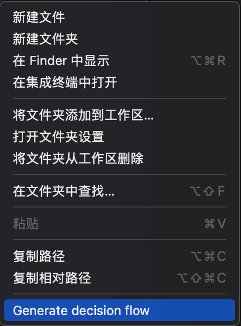
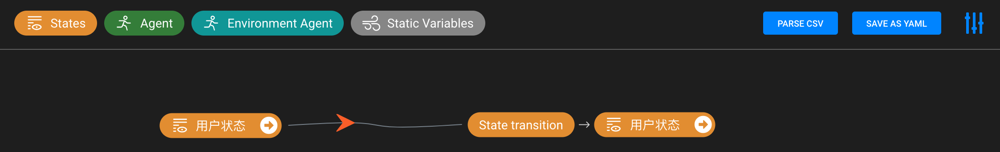
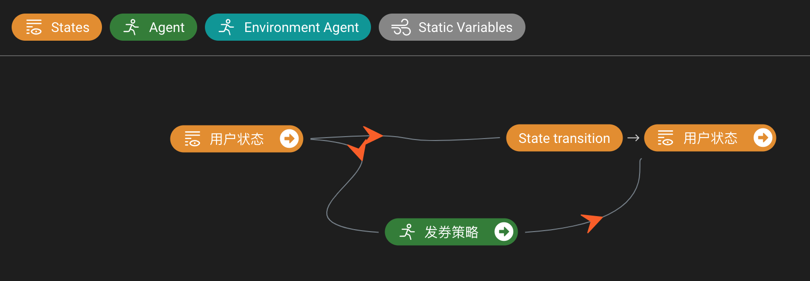
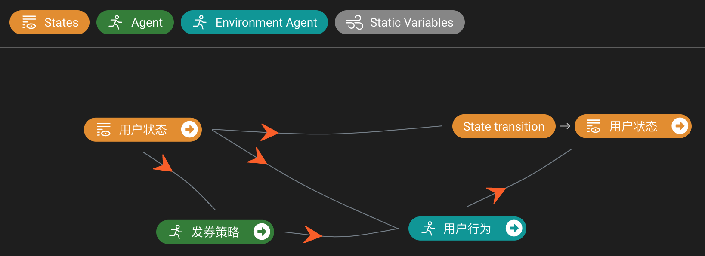
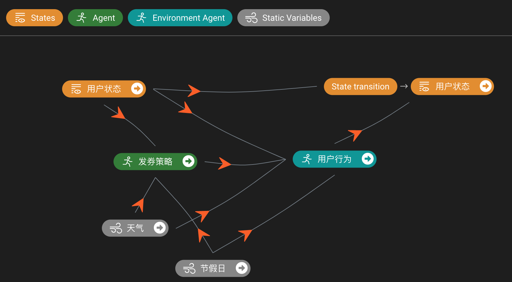
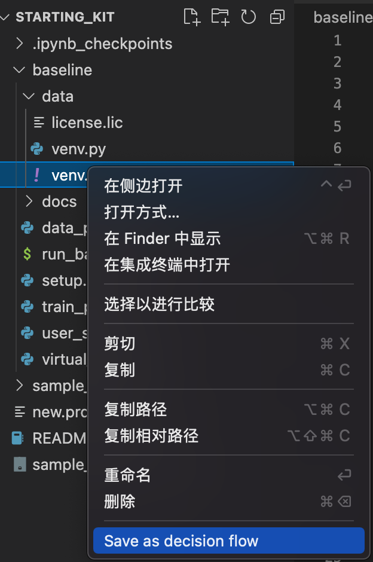
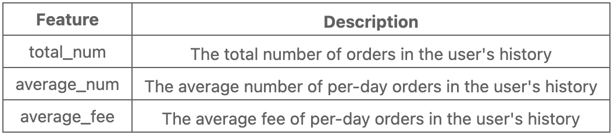
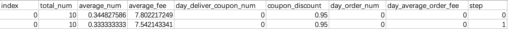
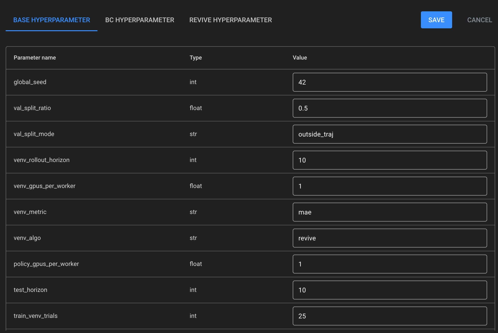

# 基于VSCode Polixir Revive插件对Baseline方案进行改进

Starting Kit的`README.ipynb`文件详细讲解了baseline方案。但是其中关于决策流图的设计和参数的调整是直接写入配置文件，较为繁杂。本示例讲解通过使用VSCode Polixir Revive扩展插件，对决策流图和参数进行便利的交互性配置。

# 开发环境的准备工作

1. `Linux x86_64` 或 `Windows 10 / Windows 11` + `Remote WSL extension`。
2. 使用 `Visual Studio Code` 作为IDE。
3. `Python 3.6, Python 3.7 or Python 3.8` + `Pytorch`. Python 3.9 暂未支持。
4. 文件路径使用ASCII字符，中文字符可能导致 `UnicodeEncodeError`。

# A. 对业务的理解

虽然同学们十分关注算法，但是对业务的理解其实至关重要。在Polixir Revive里，通过对决策流图的构建来反映我们的理解。

在VSCode扩展市场里搜索`Polixir Revive`，可以安装相应的扩展。

### 从零开始构建决策流图

安装后在VSCode“资源管理器”区域右键，可创建决策流图 `polixir-revive-decision-flow.prdf.json`：

打开 `polixir-revive-decision-flow.prdf.json`，即可绘制决策流图。

决策流图是我们对一次决策过程中所有因素之间影响关系的描述。在比赛赛题上，我们投放优惠券的决策频率是每日一次、投放的目标是用户，那么我们会关心这一天用户状态的变化。

我们首先可以认为用户的状态以一天的间隔在发生变化。如此可以通过拖拽`States / 状态`模块（即描述决策环境的状态变量）绘制决策流图如图1：

*图1. 状态转移*

历史上的策略是根据每个用户的状态进行优惠券的发放，我们对此进行建模，拖拽`Agent / 智能体`模块（即作为策略将要被进一步优化的对象），如图2：

*图2. 基本决策流图*

上图的结构也就是强化学习 `(s,a)-> s'` 的基本结构。

如果我们希望显式建模用户对发券产生的响应，那么可以添加`Environment Agent / 环境智能体`（即不会作为目标策略被进一步优化的对象）进行建模，如图3：

*图3. 用户行为建模引入决策流图*

如果我们认为天气和节假日会对用户产生影响，那么也可以通过`Static Variables / 静态变量`（即不受系统影响的变量）引入天气和节假日信息，如图4。

*图4. 静态变量引入决策流图*

对决策流图的设计取决于我们对业务的理解和可获得的数据。

### 从YAML定义文件中生成决策流图

在starting_kit中，我们可以将已预先提供的`venv.yaml`转为决策流图：

会看到`venv.prdf.json`中的决策图正是图3的结构。不同的是，`venv.yaml`中的决策图定义在`State transition`节点中引入了专家函数`venv.py`，实现对下一时刻状态的准确计算。

# B. 处理数据

决策流图成形后，我们需要导入数据，并且指定决策流图中的每一个模块对应哪些数据维度。

在starting_kit中的`README.ipynb`中可以看到，baseline方案在用户状态上将数据处理为3个维度：

通过 `data_preprocess.py` 生成`offline_592_3_dim_state.csv`文件。

这3个维度只是对用户状态的基本统计，为了取得更好的效果，可以考虑设计更能否反应用户状态的维度。

打开`offline_592_3_dim_state.csv`文件，我们可以看到如下的列名

其中，

* `index` 表示轨迹id，即过去一个月对同一用户交互的轨迹
* `step` 是在轨迹中的计步
* `total_num`、`average_num`、`average_fee` 是提取的3个用户状态维度
* `day_deliver_coupon_num`、`coupon_discount` 是系统发出的优惠券数量和折扣类型
* `day_order_num`、`day_average_order_fee` 是该用户当天的消费行为，分别是订单数量和订单平均价格

下面我们可以在决策流图的编辑界面中点击 `PARSE CSV` 载入这个csv文件，

并且点击 `FIELD SETTING`设置每个变量的类型和值域。在baseline方案的`venv.yaml`文件columns部分，可以看到为每个变量设置的类型。

# C. 设置算法参数

VSCode Polixir Revive插件也提供了更加直观的参数修改工具。

在VSCode资源浏览器里，可以在Polixir Revive SDK中找到默认的`config.json`文件（位于`baseline/revive/data/config.json`，修改后缀为`config.prhp.json`，打开即能显示参数修改的版面：

修改保存后，可将文件名改回 `config.json`，或在调用SDK执行训练时，传入参数`-rcf config.prhp.json`。

在starting_kit中的`README.ipynb`中**Config tuning for training the virtual environment** 一节介绍了主要可以设置的参数。
