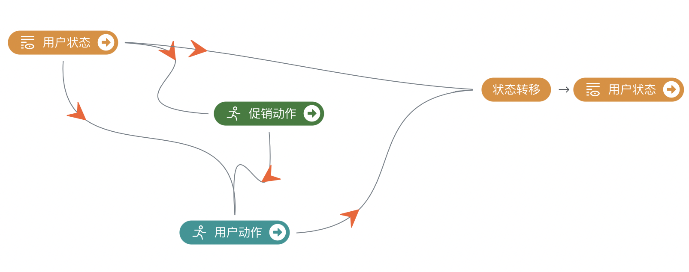
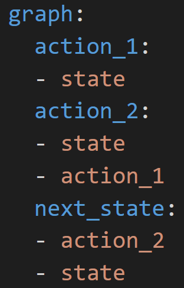

# AI决策•强化学习落地挑战赛——学习制定平等的促销策略

## 基线(baseline)方案与代码

挑战赛使用的技术方法不限。本文介绍南栖仙策为挑战赛提供的基线方案。基线方案基于Polixir Revive SDK ( 下载地址 https://revive.cn )。详细的代码实例请参考`starting_kit.zip`中的`sample_submission`文件夹。
在此方案中，我们将用Revive SDK从历史数据中学习环境模型，环境模型包含每一个用户的模拟，然后在环境模型中训练出促销策略。在这一过程中，我们将完成以下步骤：

1. 定义用户状态（用户画像）

2. 学习虚拟环境

3. 学习促销策略

以下分别介绍每个步骤。

##### 定义单个用户状态

为了学习用户模型，我们首先需要定义用户状态（即用户画像）。作为baseline，我们采取最简单(而非最好)的方式来定义每个用户的状态。

比赛数据提供了历史60天的促销动作和用户动作，每一个用户收到的促销动作每天各不相同。我们仅取60天中的前30天数据去定义用户的初始状态，后30天的数据将用于学习用户模型。

我们定义了如下表1所示的三维特征，来表示每一个用户的初始状态。值得注意的是，表1所定义的用户状态是最简单的一种方式，参赛者为了获得更好的效果需要自定义更复杂的用户状态。

| 特征名      | 说明                                        |
| ----------- | ------------------------------------------- |
| total_num   | 用户历史总订单数                            |
| average_num | 用户历史单日订单数的平均  |
| average_fee | 用户历史单日订单均价的平均 |

<center>表1. 单个用户状态定义</center>

基于表1中用户状态的定义，如果我们以`state`表示当天的用户状态,  当天用户的动作是`act`。由于`act[0]`表示用户当天订单数，`act[1]`表示用户当天订单的平均金额，所以为了得到次日的用户状态`next_state`，我们可以利用`act`直接计算`next_state`的每一维，转移规则如下代码所示：

```python
import numpy as np

next_state = np.empty(state.shape)
size = (state[0] / state[1]) if state[1] > 0 else 0
next_state[0] = state[0] + act[0]
next_state[1] = state[1] + 1 / (size + 1) * (act[0] - state[1])
next_state[2] = state[2] + 1 / (size + 1) * (act[1] - state[2])
```

我们把通过前30天的历史数据获得的用户初始状态，作为第31天的用户状态。

简单起见，基于上述转移规则，比赛数据里面我们有第31天~第60天的用户动作，我们就可以去转移生成第32天到第61天的用户状态（值得注意的是，这样的假定不符合实际情况，因为用户的状态会受到不同促销行为的影响）。

##### 基于Revive SDK进行虚拟环境学习

对于每一个用户来说，他们从第31天到第60天的用户状态、促销动作和用户动作数据符合下图1所示的决策流程图：促销策略决定促销动作，它输入当天用户状态，输出当天促销动作。用户策略决定用户动作，它输入当天用户状态、促销动作，生成当天用户动作。而有了用户动作（在baseline中简化处理**没有考虑促销动作的影响**），我们就可以生成次日用户状态。所以如果学习到了用户策略，我们就等价于学到了虚拟环境。

<center>


图1. 决策流程图
</center>

​我们采用`Revive SDK`工具来学习用户策略，`Revive SDK`支持通过编写yaml文件来描述图1的决策流程，具体如下图2所示:

<center>


图2. 决策流程对应yaml文件示例图
</center>

以graph开头的部分负责描述决策流程。其中`state`、`action_1`、`action_2`、`next_state`是自定义的变量名，在此处分别代表`当天用户状态`、`促销动作`、`用户动作`和`次日用户状态`。从yaml文件我们可以看出`action_1`的结果受`state`影响，对应决策图就是`当天用户状态`指向`促销动作`,也可以理解为`action_1`是输出，`state`是对应的输入。同理，`action_2`的结果受`state`、`action_1`影响，`next_state`的结果受`state`和`action_2`的影响。定义好yaml文件后，配置好有关训练数据和训练参数就可以调用算法包开始训练，训练完成后我们可以得到我们需要的用户策略模型`venv_model`，`venv_model`模型的使用方式是:

```python
import numpy as np

def venv_model_use_demo(states, coupon_actions):
    """调用用户策略模型
    Args:
    	states(np.array):用户状态
    	coupon_actions(np.array):发券动作
    Return:
    	user_actions(np.array):用户动作
    """
    out = venv_model.infer_one_step({'state':states, 'action_1':coupon_actions})
	return out['action_2']
```

##### 基于虚拟环境的平等化促销策略学习

对于非平等化促销策略，它输入单个用户状态，输出给单个用户发放的促销动作，因此每个人的促销动作可以各不相同。要学习一个平等化促销策略，它输入的是全体用户的状态，输出一个给全体用户发放相同的促销动作。全体用户的状态如果直接拼接成一维数组，是一个非常高维的输入，所以在输入平等化促销策略前，需要降维处理。这里我们采用最简单的方式，去计算当天全体用户状态每一维的统计量，并额外引入了两维实时统计量，实现代码如下：

```python
import numpy as np

def _states_to_obs(states: np.ndarray, day_total_order_num: int=0, day_roi: float=0.0):
    """将所有用户状态的二维数组降维为一维的用户群体的状态
        Args:
            states(np.ndarray): 包含每个用户各自状态的二维数组
            day_total_order_num(int): 全体用户前一天的总订单数，如果是初始第一天，默认为0
            day_roi(float): 全体用户前一天的ROI，如果是初始第一天，默认为0.0
        Return:
            用户群体的状态(np.array)
        """
    assert len(states.shape) == 2
    mean_obs = np.mean(states, axis=0)
    std_obs = np.std(states, axis=0)
    max_obs = np.max(states, axis=0)
    min_obs = np.min(states, axis=0)
    day_total_order_num, day_roi = np.array([day_total_order_num]), np.array([day_roi])
    return np.concatenate([mean_obs, std_obs, max_obs, min_obs, day_total_order_num, day_roi], 0)
```

降维之后得到的的用户群体的状态是平等化促销策略的真正输入，策略的动作空间则和比赛数据中保持一致。我们在`Revive SDK`中学习到的虚拟用户环境中使用强化学习算法去学习平等化促销策略。虚拟用户环境的初始状态集使用第31天到第60天、每一天的全体用户状态。转移函数基于用户策略和转移规则，输入当天全体用户状态和相同的促销动作，用户策略输出当天全体用户动作，转移规则使用全体用户动作更新全体用户状态。除此之外，问题的回报函数我们定义如下所示：

```python
from gym import Env

class VirtualMarketEnv(Env):
	MAX_ENV_STEP = 14 # 评估天数，作为环境的步长, 初赛14, 复赛30
	ROI_THRESHOLD = 7.5 # 考虑虚拟环境误差, 评估的总ROI阈值取7.5, 比实际线上6.5要高1.0
	ZERO_GMV = 81840.0763705537 #在评估环境中, 在评估天数里, 不发券带来的总GMV
    # self.total_gmv: 评估期间总的GMV, self.total_cost: 评估期间总的成本
    def step(self, action):
        ...
        # 稀疏reward, 评估最后一天返回最终的reward, 前面的天reward都是0
        if (self.current_env_step+1) < VirtualMarketEnv.MAX_ENV_STEP:
            reward = 0
        else:
            total_roi = self.total_gmv / self.total_cost
            if total_roi >= VirtualMarketEnv.ROI_THRESHOLD:
                # 超过ROI阈值, (总GMV/基线总GMV)作为回报
            	reward = self.total_gmv / VirtualMarketEnv.ZERO_GMV
            else: # 未超过ROI阈值, (总ROI - ROI阈值)作为回报
            	reward = total_roi - VirtualMarketEnv.ROI_THRESHOLD
```

确定好整个问题的MDP后，可以使用任何可行的强化学习算法，Baseline中直接使用了`Proximal Policy Optimization（PPO）`来训练最终的平等化促销策略。需要注意PPO训练的是随机策略，如果直接提交随机策略，有可能造成每次评估的结果有随机扰动。

##### 策略提交

训练好平等化促销策略后，需要上传策略进行在线评估。上传的策略是一个打包好的zip文件，其中以`policy_validation.py`作为入口点，并通过`metadata`文件指定线上评估所需要的环境（我们支持：`pytorch-1.8`, `pytorch-1.9`, `pytorch-1.10`）。

在`policy_validation.py`中，有一个`PolicyValidation`接口类，以及一个调用后返回一个`PolicyValidation`实例的`get_pv_instance()`函数。提交策略后，线上环境会调用`get_pv_instance()`，并根据`PolicyValidation`定义好的接口规范对选手的策略进行评估。选手则需要继承`PolicyValidation`接口类，实现需要的抽象方法与成员，并在`get_pv_instance()`的实现中返回自己继承的子类实例。

具体而言，`PolicyValidation`类需要：

* 以第61天的用户状态数据，初始化`PolicyValidation`类的全体用户的初始状态（对应评估的第一天的用户状态）。
* 根据当天全体用户的状态、促销动作和当天响应的用户动作，返回次日全体用户的状态。
* 据当天全体用户的状态，返回当天的促销动作。

详细的代码实例请参考`starting_kit.zip`中的`sample_submission`文件夹。
